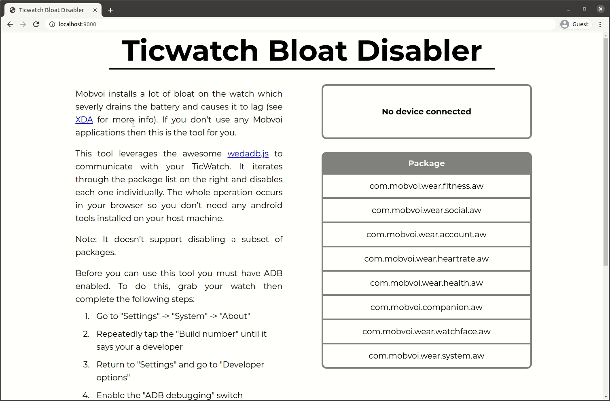

# Ticwatch Bloat Disabler

- [Overview](#overview)
- [Prerequisites](#prerequisites)
- [Web Tool](#web-tool)
  - [Usage](#usage)
  - [Development](#development)
- [Scripts](#scripts)
  - [Usage](#usage-1)

## Overview
An automated version of the steps explained in ['Make your Ticwatch smoother than ever disabling TicSystem via ADB!'](https://forum.xda-developers.com/wear-os/development/make-ticwatch-smoother-disabling-t3951734)

> **Disclaimer**: I’m not an expert and have no idea if using these tools can damage your device. I accept no responsibility for damage you do to anything. You should thoroughly read through this code to fully understand what this tool is doing before running it against your own device. Proceed at your own risk.

This leverages the awesome [wedadb.js](https://github.com/webadb/webadb.js) package to communicate with the watch, as such you don't need any android tools installed on your host machine to make it work.

There's two versions of the same tool; a bash script and a client side web tool.

## Prerequisites 

For both the web tool and the scripts:

- A ticwatch with ADB enabled:
   1. Go to 'settings' -> 'System' -> 'About' and repeatedly tap the 'Build number' until it says your a developer
   2. Back in settings, go to 'Developer options' and enable 'ADB debugging'

- A USB cable to connect the watch to the PC

And additionally for the bash scripts:

- If your using the bash scripts then a linux PC to act as the host for communicating with the Ticwatch (windows and mac may work, but i've only tested it on Ubuntu 20.04)

## Web Tool
> **Note: Only available for chromium based browsers due to the current support of WebUSB**



### Usage
Browse to http://ryangwaite.github.io/ticwatch-bloat-disabler

Then follow the prompts on the tool itself.

### Development
To build, run:
```bash
cd web-app
npm run-script build
```
The distribution code (output) is in `web-app/dist/`

To run the development server:
```bash
npm start
```

Design documentation is available [here](docs/web-app/design.md)

## Scripts

Theres two scripts here each with the following purposes:
- `tw-disable-bloat.sh` - runs on the ticwatch itself
- `disable-bloat` - runs from the host and copies and runs the `tw-disable-bloat.sh` on the Ticwatch

### Usage

First make sure you have adb installed then run:
```bash
cd cli
./disable-bloat
```
If your getting `No adb device with model 'Ticwatch_E' found` then make sure you can connect directly with ADB to the watch before trying again.