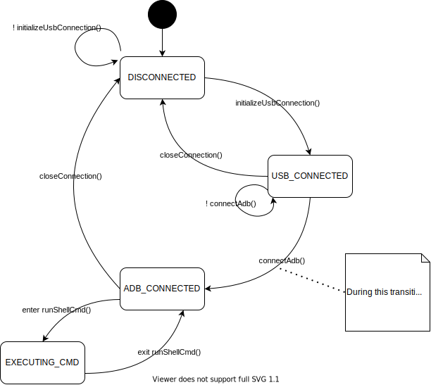

# web-app Design

## Connection Manager
The connection manager is responsible for managing the USB and ADB connection to the watch as well as sending and receiving commands and output. It is backed by a state machine which has the following states:

(Note: to edit the diagram open `connection-manager-states.drawio.svg` with the VS Code extension [hediet.vscode-drawio](https://github.com/hediet/vscode-drawio) )